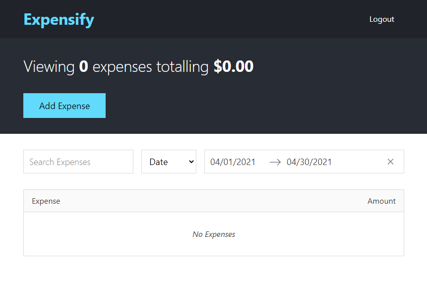

# Expensify App



Coded this expense tracking application using React while taking Andrew Mead's Udemy course - [The Complete React Developer Course (w/ Hooks and Redux)](https://www.udemy.com/course/react-2nd-edition/)

Demo can be seen in here - https://xpensify.herokuapp.com/

## Technology used

- Webpack 5
- Babel
- Babel transform class properties plugin
- React
- Redux
- React Router
- Jest
- SCSS

## Getting Started

Clone this repo:

```sh
git clone https://github.com/Saabbir/expensify-app.git
```

This project is based on [Node.js](https://nodejs.org/en/). To install the necessary packages, run this command in the root folder of the site:

```sh
npm install
```

### After Installation

- Run `npm run dev` from root folder for a development server and live reloading
- Run `npm run build` from root folder for production build

## Dev Dependencies

This project uses a number of open source projects for the development build:

- [@babel/cli](https://ghub.io/@babel/cli)
- [@babel/core](https://ghub.io/@babel/core)
- [@babel/plugin-proposal-class-properties](https://ghub.io/@babel/plugin-proposal-class-properties)
- [@babel/preset-env](https://ghub.io/@babel/preset-env)
- [@babel/preset-react](https://ghub.io/@babel/preset-react)
- [babel-loader](https://ghub.io/babel-loader)
- [css-loader](https://ghub.io/css-loader)
- [sass](https://ghub.io/sass)
- [sass-loader](https://ghub.io/sass-loader)
- [style-loader](https://ghub.io/style-loader)
- [webpack](https://ghub.io/webpack)
- [webpack-cli](https://ghub.io/webpack-cli)
- [webpack-dev-server](https://ghub.io/webpack-dev-server)

## Dependencies

This project uses a number of open source projects for the production build:

- [normalize.css](https://ghub.io/normalize.css)
- [react](https://ghub.io/react)
- [react-dom](https://ghub.io/react-dom)
- [react-modal](https://ghub.io/react-modal)